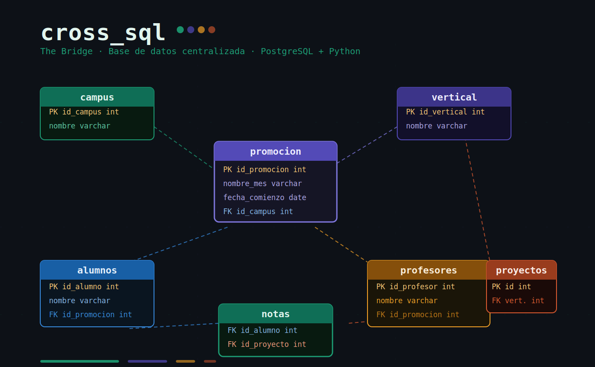

# cross_sql_thebridge

Este proyecto contiene la base de datos central de **The Bridge**, integrada por
sus tres departamentos. Su estructura permite gestionar de forma unificada la
información de sedes, cursos, alumnos y calificaciones.

## 🏗️ Estructura de la Base de Datos

La base de datos se organiza en las siguientes tablas principales:

* **campus**: Sedes físicas (ej. Madrid, Valencia).
* **vertical**: Áreas de formación (Data Science, Full Stack, etc.).
* **promocion**: Grupos específicos que unen un campus, una vertical y una fecha de inicio.
* **profesores**: Datos del equipo docente y su asignación a cada promoción.
* **alumnos**: Registro de estudiantes matriculados.
* **proyectos**: Listado de trabajos evaluables por vertical.
* **notas**: Relación de las calificaciones obtenidas por cada alumno en sus proyectos.

## 🔗 Relaciones Clave

1.  **Organización**: Las `promociones` dependen directamente de un `campus` y una `vertical`.
2.  **Asignación**: Tanto `alumnos` como `profesores` están vinculados a una `promocion` específica.
3.  **Evaluación**: La tabla `notas` sirve de puente para conectar a los `alumnos` con sus `proyectos` y registrar su calificación.

## 🛠️ Tecnologías

* **PostgresSQL** para la base de datos POSTGRESS
* **PYTHON 3.14** para la gestión de datos.
* **Dependencias**
numpy>=2.4.4
pandas>=3.0.2
pysqlite3>=0.6.0
python-dotenv>=1.2.2
sqlalchemy>=2.0.49
* **ERD** (Diagrama Entidad-Relación) para el diseño de la estructura.
* **PGAdmin 4** Interfaz gráfica para administrar la base de datos
* **Docker** Contenerización del entorno de base de datos
* **Render** Despliegue en la nube

## ⚙️ Instalación y Configuración

Prerrequisitos

Python 3.10 o superior
PostgreSQL 14 o superior (o Docker)
Git

1. Clonar el repositorio
2. Instalar dependencias de Python
3. Configurar variables de entorno (creamos un archivo .env en la raiz del proyecto donde hemos guardado las credenciales)
4. Crear la base de datos en PostgreSQL
5. Ejecutar el script de creación de tablas
6. Poblar la base de datos con datos de ejemplo

## 👥 Integrantes del proyecto

|        Nombre        |                            GitHub                          |
|----------------------|------------------------------------------------------------|
| Elena Gonzalez       | [Elegm92](https://github.com/Elegm92)                      |
| Ariela Astorga       | [arielaastorga](https://github.com/arielaastorga)          |
| Daniel Lavia         | [danilaviaart-lgtm](https://github.com/danilaviaart-lgtm/) |
| Gian Marco Assandria | [gianass-first](https://github.com/gianass-first)          |
| Jaime Rubio          | [BV-Works](https://github.com/BV-Works)                    |

---
*Base de datos colaborativa de los 2 departamentos de The Bridge.*
